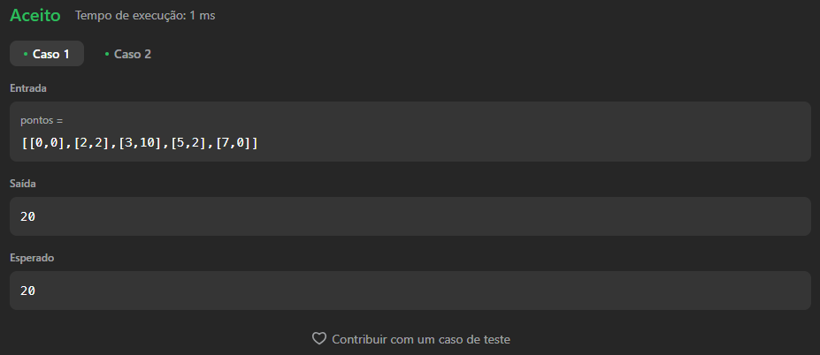

# Execícios do Leetcode

**Número da Lista**: 4<br>

**Conteúdo da Disciplina**: Algoritmos Ambiciosos<br>

## Alunos

- Dupla 51

| Matrícula | Aluno                             |
| --------- | --------------------------------- |
| 190029692 | Igor Thiago Lima de Santana |
| 202017540 | Breno Soares Fernandes      |

## Sobre

Este projeto tem como objetivo resolver questões do [LeetCode](https://leetcode.com/problemset/?search=graph&page=1&sorting=W3t9XQ%3D%3D) sobre Algoritmos Ambiciosos utilizando a linguagem de programação Python. Abaixo, estão listadas as questões selecionadas, com seus respectivos níveis de dificuldade e vídeos explicativos da resolução.

## Questões

| Nome                                                                                                                                                  | Nível   |
| ----------------------------------------------------------------------------------------------------------------------------------------------------- | ------- |
| [630. Course Schedule III](https://leetcode.com/problems/course-schedule-iii/description/)   | Difícil |
| [135. Candy](https://leetcode.com/problems/candy/description/?envType=problem-list-v2&envId=greedy) | Dificil |
| [1584. Min Cost to Connect All Points](https://leetcode.com/problems/min-cost-to-connect-all-points/description/?utm_source=chatgpt.com) | Medio |

## Video

[video](https://youtu.be/9upQ6q0z5_I)

## Screenshots

### [630. Course Schedule III](https://leetcode.com/problems/course-schedule-iii/description/) 

 **Caso 1:**


 

 **Caso 2:**

 


 **Cso 3:**

 

## Screenshots

### [135. Candy](https://leetcode.com/problems/candy/description/?envType=problem-list-v2&envId=greedy)

 **Caso 1:**

 


 **Caso 2:**

 

## Screenshots
    
### [1584. Min Cost to Connect All Points](https://leetcode.com/problems/min-cost-to-connect-all-points/description/?utm_source=chatgpt.com)

 **Caso 1:**

 


 **Caso 2:**

 


## Uso

Para executar as soluções, você pode colar o código diretamente no LeetCode ou criar casos de teste na função ```main``` do arquivo.


## Outros

Quaisquer outras informações sobre seu projeto podem ser descritas abaixo.